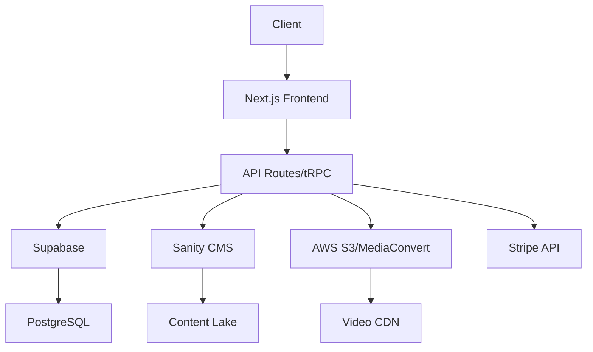
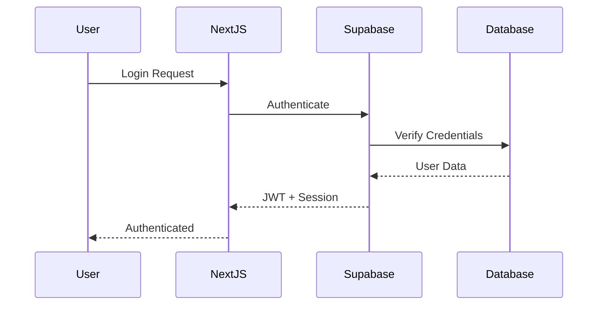

# Course Platform Architecture

## Overview
A comprehensive learning management system built with modern web technologies, featuring AI-powered assistance, real-time collaboration, and scalable microservices architecture.

## Tech Stack

### Frontend
- **Framework**: Next.js 14 (App Router)
- **UI Library**: React 18
- **Styling**: Tailwind CSS
- **State Management**: Zustand + React Query
- **Real-time**: Socket.io Client
- **Video Player**: Video.js with HLS support
- **MDX**: For rich content editing

### Backend
- **Database**: Supabase (PostgreSQL)
- **Authentication**: Supabase Auth + NextAuth.js
- **CMS**: Sanity Studio
- **API**: Next.js API Routes + tRPC
- **File Storage**: Supabase Storage + AWS S3
- **Video Processing**: AWS MediaConvert
- **Payment**: Stripe
- **Email**: Resend
- **Real-time**: Supabase Realtime + Socket.io

### Infrastructure
- **Hosting**: Vercel (Frontend) + AWS (Media)
- **CDN**: Cloudflare
- **Monitoring**: Sentry + Vercel Analytics
- **CI/CD**: GitHub Actions

## Architecture Patterns

### 1. Monorepo Structure
```
course-platform/
├── apps/
│   ├── web/          # Main Next.js application
│   ├── cms/          # Sanity Studio
│   ├── admin/        # Admin dashboard (future)
│   └── mobile/       # React Native app (future)
├── packages/
│   ├── database/     # Supabase client & types
│   ├── ui/           # Shared UI components
│   ├── types/        # Shared TypeScript types
│   ├── config/       # Shared configuration
│   ├── api/          # tRPC API definitions
│   ├── auth/         # Authentication logic
│   ├── analytics/    # Analytics tracking
│   └── video/        # Video processing utilities
```

### 2. Data Flow



### 3. Authentication Flow



## Core Features

### 1. User Management
- Multi-provider authentication (Email, Google, GitHub)
- Role-based access control (Student, Instructor, Admin)
- Profile management with avatars
- OAuth integration

### 2. Course Management
- Course creation wizard
- Drag-and-drop lesson ordering
- Rich content editor (MDX)
- Video upload and processing
- Course versioning
- Prerequisites management

### 3. Content Delivery
- Adaptive video streaming (HLS)
- Offline content download
- Interactive code exercises
- Real-time collaboration
- AI-powered explanations

### 4. Progress Tracking
- Lesson completion tracking
- Quiz and assessment scores
- Learning analytics dashboard
- Certificate generation
- Skill badges

### 5. Payment System
- Subscription plans
- One-time purchases
- Coupon/discount codes
- Revenue sharing for instructors
- Stripe integration

### 6. AI Features
- Chat-based learning assistant
- Code review and suggestions
- Personalized learning paths
- Content summarization
- Question answering

### 7. Admin Dashboard
- User management
- Course approval workflow
- Revenue analytics
- System monitoring
- Content moderation

## Security Considerations

### Authentication & Authorization
- JWT-based authentication
- Row Level Security (RLS) in Supabase
- API rate limiting
- CSRF protection
- XSS prevention

### Data Protection
- Encryption at rest and in transit
- GDPR compliance
- Regular security audits
- Secure file uploads
- Input validation

## Performance Optimization

### Frontend
- Static generation for public pages
- Incremental Static Regeneration
- Image optimization
- Code splitting
- Lazy loading
- Service workers for offline support

### Backend
- Database indexing
- Query optimization
- Redis caching
- CDN for static assets
- Video CDN with edge locations
- Connection pooling

## Scalability Strategy

### Horizontal Scaling
- Serverless functions for API
- Auto-scaling database
- CDN for global distribution
- Load balancing

### Vertical Scaling
- Database read replicas
- Caching layers
- Background job queues
- Microservices architecture (future)

## Monitoring & Analytics

### Application Monitoring
- Error tracking with Sentry
- Performance monitoring
- User analytics
- A/B testing framework

### Business Intelligence
- Course engagement metrics
- Revenue analytics
- User retention analysis
- Learning outcome tracking

## Future Enhancements

### Phase 2
- Mobile applications (iOS/Android)
- Live streaming classes
- Discussion forums
- Peer-to-peer learning
- Gamification elements

### Phase 3
- VR/AR content support
- AI-generated courses
- Multi-language support
- White-label solution
- Blockchain certificates